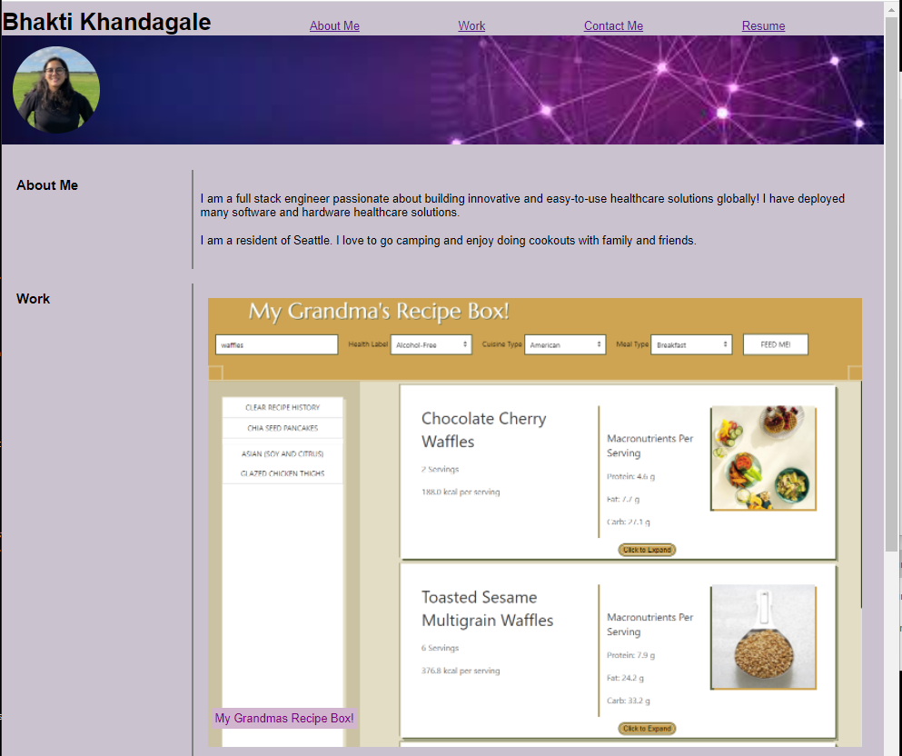
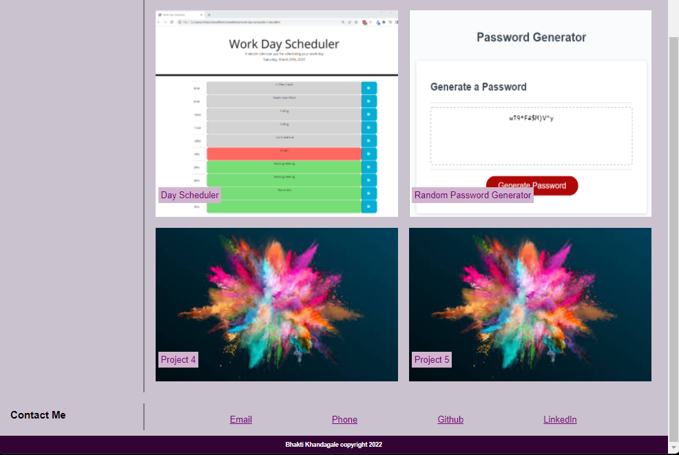

# Bhaktis-Portfolio

Bhakti's coding skills all in one place!

The index.html consists overall strcuture for Bhakti's Portfolio.
style.css provides the styling for Bhakti's Portfolio.

The Portfolio styling is optimized for different screen sizes.

This portfolio is a work in progress and will be updated in the upcoming weeks to include built projects instead of placeholder images, links.

*Link to deployed application:*
https://bkhandag.github.io/Bhaktis-Portfolio/

*Screenshot:*

*References:*
Used this site to make grid using flex box
https://www.taniarascia.com/easiest-flex-grid-ever/

Banner image address:
https://t3.ftcdn.net/jpg/02/68/48/86/360_F_268488616_wcoB2JnGbOD2u3bpn2GPmu0KJQ4Ah66T.jpg

Place holder image:
https://encrypted-tbn0.gstatic.com/images?q=tbn:ANd9GcSFeoD7D_idWVYoIOR0HvwAanpi_Rmnx7vI1Q&usqp=CAU